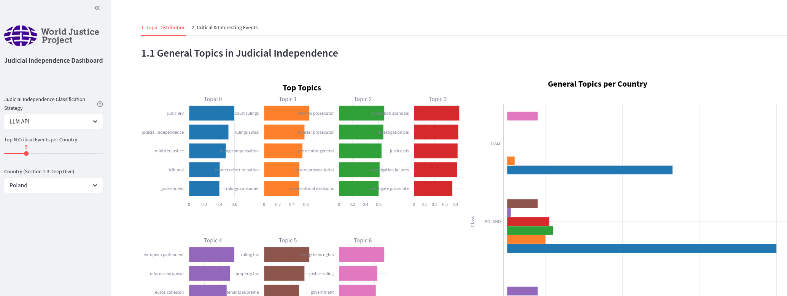

# WJP Independencia Judicial

Pipeline de NLP para detectar y analizar eventos de independencia judicial (IJ) a partir de resúmenes de noticias por país, construido sobre el marco del [World Justice Project](https://worldjusticeproject.org/).



---

## Instalación

**Requisitos**: [`uv`](https://docs.astral.sh/uv/getting-started/installation/)

**Solo resultados** (sin dependencias del pipeline):

```bash
git clone https://github.com/dataguirre/wjp-judicial-independence.git
cd wjp-judicial-independence
uv sync
uv run streamlit run app.py
```

> Para reproducir los datos desde cero (modelos locales, GPU), ver [Reproducibilidad](#reproducibilidad).

---

## Estructura del proyecto

```
├── src/wjp_judicial_independence/
│   ├── __init__.py
│   ├── config.py           # Configuración de rutas
│   ├── preprocessing.py    # Extracción de eventos
│   ├── classifier.py       # Módulo 1: clasificación binaria
│   ├── sentiment.py        # Módulo 2a: clasificación de sentimiento
│   ├── analysis.py         # Comparación de estrategias
│   ├── plot.py             # Visualizaciones
│   └── utils.py            # Despacho de API y reintentos
├── notebooks/
│   ├── module1_classification.ipynb
│   ├── module2_sentiment.ipynb
│   ├── module2_topic_modelling.ipynb
│   └── module3_visualization_and_analysis.ipynb
├── scripts/
│   ├── pipeline.py                       # Pipeline de extremo a extremo
│   └── precompute_topics_per_class.py    # Caché de artefactos para el dashboard
├── data/
│   ├── raw/                # Archivos JSON por país
│   └── interim/            # Salidas del pipeline (Parquet + JSON)
├── assets/                 # Recursos estáticos (logos, capturas)
├── .streamlit/             # Configuración de tema Streamlit
└── app.py                  # Dashboard Streamlit
```

---

## Descripción general

El pipeline procesa resúmenes de noticias estructurados de tres países (Hungría, Italia, Polonia) y produce:

1. **Módulo 1**: Clasificación binaria. ¿El evento es relevante para la independencia judicial?
2. **Módulo 2a**: Clasificación de sentimiento. ¿El evento *amenaza*, *fortalece* o es *neutral* respecto a la IJ?
3. **Módulo 2b**: Modelado de temas con BERTopic. ¿Cuáles son los temas principales dentro de los eventos relevantes?
4. **Dashboard**: Aplicación Streamlit para explorar resultados por estrategia, país y tema.

---

## Enfoque metodológico

### Extracción de eventos

Los datos crudos son archivos JSON por país con resúmenes anidados por pilar WJP y categoría de impacto (Muy Positivo → Muy Negativo). Los eventos se extraen a nivel de párrafo filtrando líneas con la convención `* **`, que captura descripciones de eventos individuales y descarta títulos, conclusiones y metadatos editoriales.

### Clasificación (Módulo 1)

Se implementan tres estrategias en paralelo para comparar robustez:

| Estrategia | Método | Coste | Velocidad |
|------------|--------|-------|-----------|
| `embeddings` | Similitud coseno contra descripciones de referencia con `all-mpnet-base-v2` | Gratuito | ~2 min |
| `llm` | Inferencia local con Qwen2.5-7B-Instruct (4 bits) | Gratuito (GPU) | ~4 min |
| `llm-api` | Inferencia vía API con GPT-4o-mini o Claude | ~$2–3 / 1K eventos | ~10–15 min |

Las tres comparten el mismo prompt: un mensaje de sistema con 10 criterios de inclusión y 5 de exclusión basados en las definiciones del WJP.

### Clasificación de sentimiento (Módulo 2a)

Sobre los eventos marcados como relevantes, la misma arquitectura de tres estrategias asigna una etiqueta (**amenaza**, **fortalecimiento** o **neutral**) usando definiciones de la literatura sobre IJ. El sentimiento se desacopla del encuadre mediático: una noticia con framing negativo puede representar un fortalecimiento si los tribunales actuaron de forma independiente.

### Modelado de temas (Módulo 2b)

BERTopic con `all-mpnet-base-v2`, UMAP y HDBSCAN. Se entrenan un modelo general (8 temas) y modelos por país, estratificados por sentimiento y pilar WJP. Los artefactos se pre-computan una vez con `scripts/precompute_topics_per_class.py` y se cachean como Parquet y JSON; el dashboard los carga sin depender de modelos ML en tiempo de ejecución.

---

## Decisiones de diseño

**Tres estrategias en vez de una.** Comparar embeddings, LLM local y LLM API permite medir acuerdo entre estrategias: las discrepancias señalan casos ambiguos que merecen revisión. El usuario elige su propio balance entre coste y calidad.

**Relevancia y sentimiento por separado.** Clasificar *si* un evento es relevante de forma independiente a *cómo* afecta la IJ evita confundir el encuadre mediático con el impacto judicial. Un evento "Muy Negativo" en los datos puede representar un fortalecimiento de la IJ.

**Cuantización a 4 bits.** Inferencia con BitsAndBytes para que la estrategia LLM local funcione sin GPU de alta gama.

**Prompts en lugar de fine-tuning.** La adaptación al dominio vive en el prompt, no en los pesos del modelo. Cambiar las definiciones no requiere reentrenar.

**Pre-computación.** El pipeline costoso se ejecuta una vez; el dashboard carga artefactos pre-calculados con tiempos de menos de un segundo.

---

## Limitaciones

**Dataset pequeño.** ~1.200 eventos de tres países. Los resultados son exploratorios, no generalizables.

**Sin evaluación humana.** Ninguna estrategia se ha calibrado contra etiquetas anotadas por expertos. El acuerdo entre estrategias es una verificación de consistencia, no de precisión.

**Embeddings con referencias manuales.** Las descripciones de referencia y el umbral (0,5) no han sido validados contra verdad de terreno.

**Fragilidad de extracción y parsing.** El filtro `* **` es específico al formato de los JSON de origen. Las estrategias LLM parsean salidas por subcadena; respuestas inesperadas caen a la clase por defecto sin aviso.

**Hiperparámetros fijos.** La configuración de UMAP, HDBSCAN y el número de temas se eligió por inspección, no por búsqueda sistemática.

---

## Reproducibilidad

Instalar las dependencias del pipeline:

```bash
uv sync --extra pipeline
```
> Todo el pipeline se ejecutó con una GPU RTX 3090. Por lo que no se garantiza completa reproducibilidad sin recursos computacionales mínimos. De igual forma, se utilizó aproximadamente $2 para pruebas con el modelo de openAI en la estrategia `llm-api` del módulo 1

Hay dos formas equivalentes de reproducir los datos y resultados:

### Opción A: Notebooks

Ejecutar los notebooks en orden. El módulo 1 produce la clasificación binaria; el módulo 2 produce sentimiento y modelado de temas. Después, pre-computar los artefactos del dashboard:

```bash
uv run jupyter lab # Abrir la interfaz de jupyter lab
# Ejecutar manualmente los notebooks: module1 > module2_topic > module2_sentiment
uv run scripts/precompute_topics_per_class.py
uv run streamlit run app.py # o ejecutar manualmente el notebook del modulo 3
```

### Opción B: Script del pipeline

`pipeline.py` encapsula los módulos 1 y 2 en un solo comando. El script de pre-computación sigue siendo necesario antes de lanzar el dashboard:

```bash
uv run scripts/pipeline.py --strategies embeddings llm-api --api-provider openai --api-key <KEY>
uv run scripts/precompute_topics_per_class.py
uv run streamlit run app.py
```

### Opciones del pipeline

| Flag | Descripción |
|------|-------------|
| `--strategies` | Una o más de: `embeddings`, `llm`, `llm-api` |
| `--api-provider` | `openai` o `anthropic` (requerido para `llm-api`) |
| `--api-key` | Clave API del proveedor elegido |
| `--api-model` | Nombre del modelo (p. ej. `gpt-4o-mini`, `claude-3-5-haiku-latest`) |
| `--force` | Re-ejecutar pasos aunque la salida ya exista |
